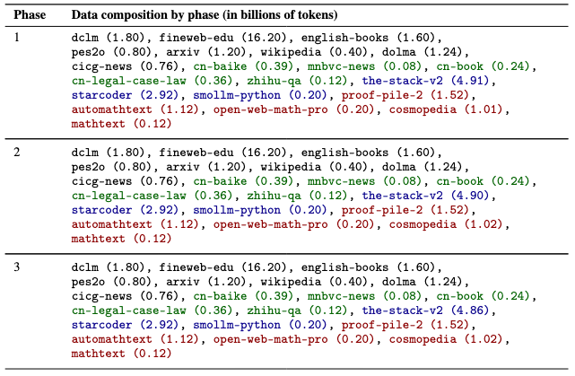
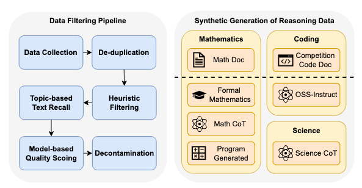

<h4 align="center">
    <p>
        <b>中文</b> | <a href="">English</a>
    <p>
</h4>

<div align=center>

<h1>YuLan-Mini: An Open Data-efficient Language Model</h1>
<a href="https://github.com/RUC-GSAI/YuLan-Mini/blob/main/LICENSE"></a>
<a href="https://arxiv.org/abs/" target="_blank"></a>
<a href="https://huggingface.co/rucaibox"></a>
<a></a>
</div>

YuLan-Mini is a lightweight language model with 2.42B parameters. Despite being pretrained on only 1.08T tokens, it achieves performance comparable to industry-leading models trained on larger datasets.

---

#### Model Download 🔗

|  Model  | Context Length |
|--------|-------|
|  [YuLan-Mini-2.4B](https://huggingface.co/rucaibox/YuLan-Mini-2.4B)  |  28K |
|  [YuLan-Mini-2.4B-4k](https://huggingface.co/rucaibox/YuLan-Mini-2.4B-4K) |  4K |

---

#### Capabilities 🌟

<div align=center>

</div>

Our pretraining approach improves training efficiency through three key innovations:

1. A refined data processing pipeline combining data cleaning with scheduling strategies;
2. Robust optimization methods to mitigate training instability;
3. An efficient annealing strategy integrating target data selection with long-context training.

To support reproducibility, we will open-source relevant pretraining resources.

---

#### Inference Code 💻

Below is a simple example of inference using Huggingface and vLLM:

**Huggingface Inference Example**
```python
from transformers import AutoTokenizer, AutoModelForCausalLM

# Load the model and tokenizer
tokenizer = AutoTokenizer.from_pretrained("rucaibox/YuLan-Mini-2.4B")
model = AutoModelForCausalLM.from_pretrained("rucaibox/YuLan-Mini-2.4B")

# Input text
input_text = "Renmin University of China is"
inputs = tokenizer(input_text, return_tensors="pt")

# Inference
output = model.generate(inputs["input_ids"], max_new_tokens=100)
print(tokenizer.decode(output[0], skip_special_tokens=True))
```

---

#### Pretraining Resources 🔧

To enhance research transparency and reproducibility, we will open-source the following [pretraining resources](https://github.com/RUC-GSAI/YuLan-Mini/blob/main/pretrain):

<details><summary>1. Pretraining and Evaluation Code</summary>

The pretraining and evaluation code will be released later.
</details>

<details><summary>2. Optimizer States Before Annealing</summary>

Optimizer states before annealing will be released later.
</details>

<details><summary>3. Data Ratios for Each Stage</summary>

<div align=center>

</div>
</details>

<details><summary>4. Synthetic Data</summary>

Data cleaning and synthesis process:
<div align=center>

</div>
</details>

<details><summary>5. Intermediate Optimizer States</summary>

Intermediate optimizer states will be released later.
</details>

---

## Team

YuLan-Mini is developed by the [AI Box](http://aibox.ruc.edu.cn/) team at Renmin University of China.

## License

- The code in this repository is released under the [MIT License](./LICENSE).
- Policies for using model weights, intermediate optimizer states, and training data will be announced later.
- Limitations: While we strive to minimize potential safety issues and encourage the generation of ethical and legally compliant text, as a probabilistic language model, unexpected outputs may still occur. For example, responses may contain bias, discrimination, or other harmful content. Please avoid spreading such content. We are not liable for any consequences resulting from the dissemination of harmful information.

### Citation

If you find YuLan-Mini helpful for your research or development, please cite the following paper:

```
```
