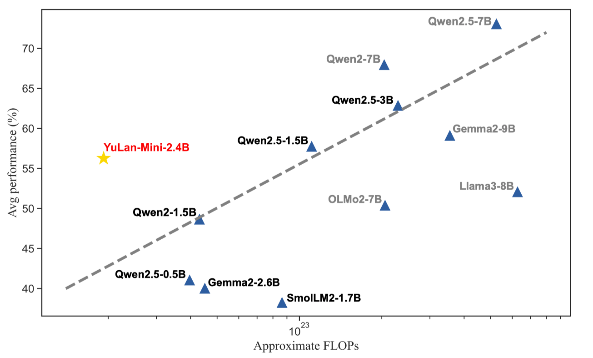

<h4 align="center">
    <p>
        <b>中文</b> | <a href="https://github.com/RUC-GSAI/YuLan-Mini/blob/main/README-en.md">English</a>
    <p>
</h4>

<div align=center>

<h1>YuLan-Mini: 数据高效的开源语言模型</h1>
<a href="https://github.com/RUC-GSAI/YuLan-Mini/blob/main/LICENSE"></a>
<a href="https://arxiv.org/abs/2412.17743" target="_blank"></a>
<a href="https://huggingface.co/rucaibox"></a>
<a></a>
</div>

YuLan-Mini 是一个 2.42B 参数量的轻量化语言模型。仅使用 1.08T Tokens 进行预训练，却达到了与使用更多数据的行业领先模型相媲美的性能，尤其是 **数学** 和 **代码** 两个领域。为方便复现，我们将开源相关预训练资源。

---

### 模型下载 🔗

> 我们将在整理后上传模型权重

|  模型  | 上下文长度 |
|--------|-------|
|  [YuLan-Mini-2.4B](https://huggingface.co/rucaibox/YuLan-Mini-2.4B)（推荐）  |  28K |
|  [YuLan-Mini-2.4B-4k](https://huggingface.co/rucaibox/YuLan-Mini-2.4B-4K) |  4K |

---

### 能力介绍 🌟

<div align=center>

</div>

我们的预训练方法通过以下三项关键技术改进提升了训练效率：

1. 精细的数据处理流程，将数据清洗与数据课程策略相结合；
2. 稳定的优化方法，有效缓解预训练中的不稳定性；
3. 高效的退火策略，融合了目标数据选择和长上下文训练。

最终，使用我们的高效预训练策略，仅 1T 的数据量便可在数学和代码等领域，媲美 Qwen2.5-1.5B 在 18T 数据上的效果。其中，指令数据仅占 3.5%。

---

### 推理代码 💻

以下是使用 Huggingface 的简单推理代码示例：

**Huggingface 推理示例**
```python
from transformers import AutoTokenizer, AutoModelForCausalLM

# 加载模型和分词器
tokenizer = AutoTokenizer.from_pretrained("rucaibox/YuLan-Mini-2.4B")
model = AutoModelForCausalLM.from_pretrained("rucaibox/YuLan-Mini-2.4B")

# 输入文本
input_text = "Renmin University of China is"
inputs = tokenizer(input_text, return_tensors="pt")

# 推理
output = model.generate(inputs["input_ids"], max_new_tokens=100)
print(tokenizer.decode(output[0], skip_special_tokens=True))
```

---

### 预训练资源 🔧

为了提升研究的透明度和可复现性，我们将开源相关[预训练资源](https://github.com/RUC-GSAI/YuLan-Mini/blob/main/pretrain)：


<details><summary>1. 预训练和评测代码</summary>

预训练和评测代码将在后续公布。
</details>


<details><summary>2. 退火前优化器状态</summary>

退火前优化器状态将在后续公布。
</details>

<details><summary>3. 使用的开源数据集</summary>
<div >
<a href="https://github.com/RUC-GSAI/YuLan-Mini/blob/main/pretrain/datasets-list.md">Used Datasets List</a>
</div>
</details>


<details><summary>4. 逐阶段的数据配比</summary>

<div align=center>

</div>
</details>

<details><summary>5. 合成数据</summary>

数据清洗和合成流程：
<div align=center>

</div>
</details>

<details><summary>6. 中间阶段优化器状态</summary>

中间阶段优化器状态将在后续公布。
</details>


---

### 团队

YuLan-Mini 由中国人民大学 [AI Box](http://aibox.ruc.edu.cn/) 团队开发。

### 许可协议

- 本仓库代码使用 [MIT License](./LICENSE)。
- 关于模型权重、中间优化器状态和训练数据的使用政策将在后续公布。
- 局限性：尽管我们尝试减少模型在使用中可能出现的安全性问题，并鼓励模型生成符合道德和法律要求的文本，但由于语言模型基于概率生成的范式，模型仍然可能会产生意外的输出。例如，生成的响应可能包含偏见、歧视或其他有害内容。请不要传播此类内容。我们对因传播有害信息而造成的任何后果不承担任何责任。

### 引用

如果您发现 YuLan-Mini 对您的研究或开发有帮助，请引用我们的[技术报告](https://arxiv.org/abs/2412.17743)：

```
@misc{hu2024yulanmini,
      title={YuLan-Mini: An Open Data-efficient Language Model}, 
      author={Yiwen Hu and Huatong Song and Jia Deng and Jiapeng Wang and Jie Chen and Kun Zhou and Yutao Zhu and Jinhao Jiang and Zican Dong and Wayne Xin Zhao and Ji-Rong Wen},
      year={2024},
      eprint={2412.17743},
      archivePrefix={arXiv},
      primaryClass={cs.CL},
      url={https://arxiv.org/abs/2412.17743}, 
}
```
