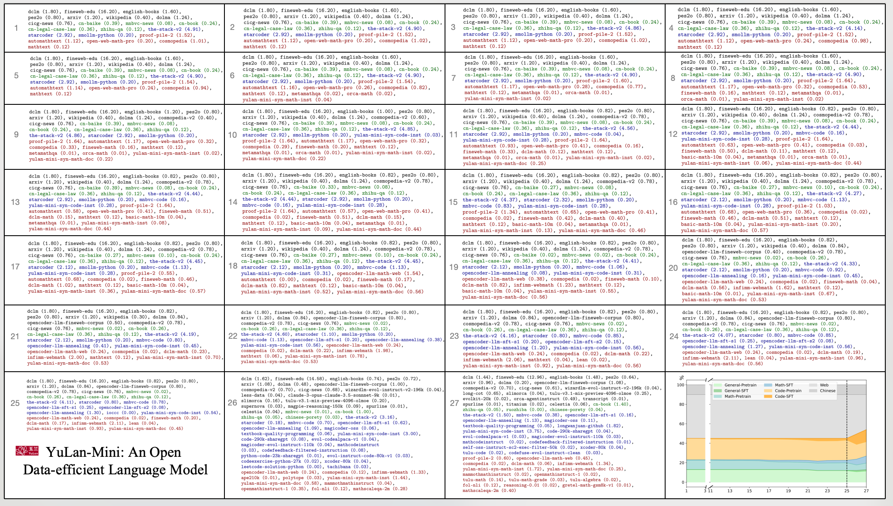

<h4 align="center">
    <p>
        <a href="https://github.com/RUC-GSAI/YuLan-Mini/blob/main/README_zh.md">中文</a> | <a href="https://github.com/RUC-GSAI/YuLan-Mini/blob/main/README.md">English</a> | <b>日本語</b>
    <p>
</h4>

<div align=center>

<h1>YuLan-Mini: データ効率の高いオープンな言語モデル</h1>
<a href="https://github.com/RUC-GSAI/YuLan-Mini/blob/main/LICENSE"></a>
<a href="https://arxiv.org/abs/2412.17743" target="_blank"></a>
<a href="https://huggingface.co/collections/yulan-team/yulan-mini-676d214b24376739b00d95f3"></a>
<a></a>
</div>

YuLan-Miniは2.4Bパラメータの軽量な言語モデルです。1.08Tトークンのみを使用して事前トレーニングを行い、特に**数学**と**コード**の分野で、より多くのデータを使用した業界トップのモデルと同等の性能を達成しています。再現性を高めるために、関連する事前トレーニングリソースをオープンソース化します。

---

## モデルのダウンロード 🔗

|  Model  | Context Length | SFT | 🤗 Hugging Face | Wise Model |
|---------|----------------|-----|-----------------|------------|
| YuLan-Mini (Recommended) | 28K | ❎ | [`YuLan-Mini`](https://huggingface.co/yulan-team/YuLan-Mini) | [`YuLan-Mini`](https://wisemodel.cn/models/yulan-team/YuLan-Mini) |
| YuLan-Mini-2.4B-4K | 4K | ❎ | | |
| YuLan-Mini-Instruct | Comming soon | ✅ | | |

---

## 特徴 🌟

<div align=center>

</div>

私たちの事前トレーニング方法は、以下の3つの重要な技術革新によりトレーニング効率を向上させます：

1. データクリーニングとデータスケジュール戦略を組み合わせた精巧な**データパイプライン**。
2. トレーニングの不安定性を効果的に緩和する体系的な**最適化方法**。
3. ターゲットデータ選択と長いコンテキストトレーニングを統合した効果的な**アニーリングアプローチ**。

---
## ベンチマーク 🌟

|      モデル      | モデルサイズ | トレイントークン数 | コンテキスト長 | MATH 500 | GSM 8K | Human Eval | MBPP   | RACE Middle | RACE High | RULER  |
|:----------------|----------:|--------------:|--------------:|:--------|:------|:----------|:------|:-----------|:---------|:------|
|     MiniCPM      |    2.6B    |     1.06T      |       4K       |   15.00  |  53.83 |     50.00* |  47.31 |     56.61   |   44.27   |   N/A  |
|      Qwen-2      |    1.5B    |       7T       |      128K      |   22.60  | 46.90* |     34.80* | 46.90* |     55.77   |   43.69   |  60.16 |
|     Qwen2.5      |    0.5B    |      18T       |      128K      |   23.60  | 41.60* |     30.50* | 39.30* |     52.36   |   40.31   |  49.23 |
|     Qwen2.5      |    1.5B    |      18T       |      128K      |   **45.40**  | **68.50\*** |     37.20* | 60.20* |     **58.77**   |   44.33   |  <ins>68.26</ins> |
|     Gemma2       |    2.6B    |       2T       |       8K       |   18.30* | 30.30* |     19.50* | 42.10* |       -     |      -    |   N/A  |
|    StableLM2     |    1.7B    |       2T       |       4K       |     -    |  20.62 |      8.50* |  17.50 |     56.33   |   **45.06**   |   N/A  |
|    SmolLM2       |    1.7B    |      11T       |       8K       |   11.80  |    -   |     23.35  |  45.00 |     55.77   |   43.06   |   N/A  |
|    Llama3.2      |    3.2B    |       9T       |      128K      |    7.40  |    -   |     29.30  |  49.70 |     55.29   |   43.34   |  **77.06** |
|    YuLan-Mini    |    2.4B    |     1.04T      |       4K       |   32.60  |  66.65 |     <ins>61.60</ins>  |  **66.70** |     55.71   |   43.58   |   N/A  |
|    YuLan-Mini    |    2.4B    |     1.08T      |      28K       |  <ins>37.80</ins>  |  <ins>68.46</ins> |    **64.00**  |  <ins>65.90</ins>|     <ins>57.18</ins>   |   <ins>44.57</ins>   |  51.48 |


|      モデル      | LAMBADA | MMLU  | CMMLU | CEval | HellaSwag | WinoGrande | StoryCloze | ARC-e | ARC-c |
|:----------------|:-------|:-----|:-----|:-----|:----------|:-----------|:-----------|:-----|:-----|
|   MiniCPM-2.6B   |  61.91  | 53.37 | 48.97 | 48.24 |   67.92    |     65.74   |     78.51   | 55.51 | 43.86 |
|   Qwen2-1.5B     |  64.68  | 55.90 | **70.76** | **71.94** |   66.11    |     66.14   |     77.60   | 62.21 | 42.92 |
|  Qwen2.5-0.5B    |  52.00  | 47.50 | 52.17 | 54.27 |   50.54    |     55.88   |     71.67   | 56.10 | 39.51 |
|  Qwen2.5-1.5B    |  62.12  | <ins>60.71</ins> | <ins>67.82</ins> | <ins>69.05</ins> |   67.18    |     64.48   |     76.80   | **71.51** | <ins>53.41</ins> |
|   Gemma2-2.6B    |    -    | 52.20*|   -   | 28.00*|   <ins>74.60*</ins>   |    **71.50\***   |       -     |   -   | **55.70\***|
| StableLM2-1.7B   |  66.15  | 40.37 | 29.29 | 26.99 |   69.79    |     64.64   |     <ins>78.56</ins>   | 54.00 | 40.78 |
|  SmolLM2-1.7B    |  <ins>67.42</ins>  | 51.91 | 33.46 | 35.10 |   72.96    |     67.40   |     **79.32**   | 44.82 | 35.49 |
|   Llama3.2-3B    |  **69.08**  | **63.40** | 44.44 | 44.49 |   **75.62**    |     <ins>67.48</ins>   |     76.80   | <ins>70.12</ins> | 48.81 |
|    YuLan-Mini    |  64.72  | 51.79 | 48.35 | 51.47 |   68.65    |     67.09   |     76.37   | 69.87 | 50.51 |
|    YuLan-Mini    |  65.67  | 49.10 | 45.45 | 48.23 |   67.22    |     67.24   |     75.89   | 67.47 | 49.32 |

---

## 事前トレーニングリソース 🔧

研究の透明性と再現性を高めるために、関連する[事前トレーニングリソース](https://github.com/RUC-GSAI/YuLan-Mini/blob/main/pretrain)をオープンソース化します：

<details><summary>1. 事前トレーニングと評価コード</summary>

事前トレーニングと評価コードは今後のアップデートで公開されます。
</details>


<details><summary>2. 中間段階のチェックポイント</summary>
中間段階のチェックポイントは<a href="https://huggingface.co/collections/yulan-team/yulan-mini-676d214b24376739b00d95f3">YuLan-Mini</a>で公開されています。

</details>

<details><summary>3. アニーリング前のオプティマイザーステート</summary>

アニーリング前のオプティマイザーステートは今後のアップデートで公開されます。
</details>


<details><summary>4. 使用したオープンソースデータセット</summary>

<a href="https://github.com/RUC-GSAI/YuLan-Mini/blob/main/pretrain/datasets">使用データセットリスト</a>

</details>

<details><summary>5. 各フェーズのデータ分布</summary>

<a href="https://github.com/RUC-GSAI/YuLan-Mini/blob/main/pretrain/datasets/final.pdf">
  <div align=center>
    
  </div>
</a>

</details>

<details><summary>6. 合成データ</summary>

データクリーニングと合成パイプライン：
<div align=center>

</div>

私たちが使用している合成データは<a href="https://huggingface.co/collections/yulan-team/yulan-mini-676d214b24376739b00d95f3">YuLan-Mini-Datasets</a>で公開されています。

</details>

<details><summary>7. 中間オプティマイザーステート</summary>

中間オプティマイザーステートは今後のアップデートで公開されます。
</details>


### これらの事前トレーニングリソースでできること

1. **独自のLLMを事前トレーニング**。私たちのデータとカリキュラムを使用して、YuLan-Miniと同等の強力なモデルをトレーニングできます。
2. **学習率アニーリング**を独自に実行。アニーリングフェーズ中、YuLan-Miniの学習能力はピークに達します。アニーリング前のチェックポイントからトレーニングを再開し、独自のデータセットを使用して学習率アニーリングを行うことができます。
3. **LLMのInstructバージョンを微調整**。YuLan-Miniベースモデルを使用して、独自のInstructバージョンをトレーニングできます。
4. **トレーニングダイナミクス**の研究。YuLan-Miniの中間チェックポイントを使用して、事前トレーニングプロセス中の内部変化を探ることができます。
5. **独自のデータを合成**。YuLan-Miniのデータパイプラインを使用して、独自のデータセットをクリーニングおよび生成できます。

---

## クイックスタート 💻

以下はHuggingfaceを使用した簡単な推論コードの例です：

**Huggingface推論例**
```python
import torch
from transformers import AutoTokenizer, AutoModelForCausalLM

# モデルとトークナイザーをロード
tokenizer = AutoTokenizer.from_pretrained("yulan-team/YuLan-Mini")
model = AutoModelForCausalLM.from_pretrained("yulan-team/YuLan-Mini", torch_dtype=torch.bfloat16)

# 入力テキスト
input_text = "Renmin University of China is"
inputs = tokenizer(input_text, return_tensors="pt")

# 推論
output = model.generate(inputs["input_ids"], max_new_tokens=100)
print(tokenizer.decode(output[0], skip_special_tokens=True))
```

**vLLMサーブ例**
```bash
vllm serve yulan-team/YuLan-Mini --dtype bfloat16
```

**SGLangサーブ例**
```bash
python -m sglang.launch_server --model-path yulan-team/YuLan-Mini --port 30000 --host 0.0.0.0
```

---

## チーム

YuLan-Miniは[中国人民大学AIボックス](http://aibox.ruc.edu.cn/)によって開発および維持されています。

## ライセンス

- このリポジトリのコードは[MITライセンス](./LICENSE)の下で公開されています。
- モデルの重み、中間オプティマイザーステート、およびトレーニングデータの使用に関するポリシーは今後のアップデートで発表されます。
- 制限事項：安全性の懸念を緩和し、倫理的かつ合法的なテキストの生成を奨励するために努力していますが、言語モデルの確率的な性質により、予期しない出力が発生する可能性があります。たとえば、応答には偏見、差別、またはその他の有害な内容が含まれることがあります。このような内容を広めないでください。有害な情報の拡散によって生じるいかなる結果についても責任を負いません。

## 引用

YuLan-Miniが研究や開発に役立つ場合は、[技術報告書](https://arxiv.org/abs/2412.17743)を引用してください：

```
@misc{hu2024yulanmini,
      title={YuLan-Mini: An Open Data-efficient Language Model},
      author={Yiwen Hu and Huatong Song and Jia Deng and Jiapeng Wang and Jie Chen and Kun Zhou and Yutao Zhu and Jinhao Jiang and Zican Dong and Wayne Xin Zhao and Ji-Rong Wen},
      year={2024},
      eprint={2412.17743},
      archivePrefix={arXiv},
      primaryClass={cs.CL},
      url={https://arxiv.org/abs/2412.17743},
}
```
