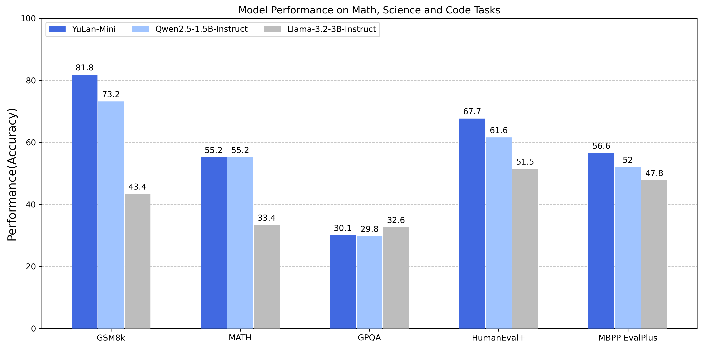

## 1. Introduction

We introduce **YuLan-Mini-Instruct**, a compact yet powerful model with 2.4 billion parameters. YuLan-Mini-Instruct represents a post-training adaptation of [YuLan-Mini](https://arxiv.org/abs/2412.17743) base model. By leveraging efficient training on both open and synthetic data, the model achieves performance comparable to mainstream models (such as Qwen-1.5b and LLaMA-3B), without compromising its core capabilities in math and code.
YuLan-Mini-Instruct is pre-trained on 1.08 trillion tokens and further enhanced through a post-training pipeline  that incorporates Supervised Fine-Tuning, Preference Finetuning, and Reinforcement Learning to maximize its capabilities.
Extensive evaluations demonstrate that YuLan-Mini-Instruct achieves state-of-the-art performance, demonstrating competitive capabilities with leading industrial counterparts across multiple domains including instruction-following, math, code, and reasoning tasks. The model is available at https://huggingface.co/yulan-team/YuLan-Mini-Instruct.

## 2. Model Overview

**YuLan-Mini-Instruct** exhibits competitive performance compared to similarly sized models, particularly in reasoning tasks involving math and code.
We evaluate YuLan-Mini-Instruct against other models from the frontier series with similar parameter sizes, including Qwen2.5-1.5B-Instruct and Llama3.2-3B-Instruct. 



## 3. Supervised Finetuning

### Data
#### Data Source
We meticulously select two primary data sources: 1) Open-source data and 2) Synthetic Data, ensuring that our model achieves comprehensive knowledge coverage and robust domain-specific expertise.

##### Open-source data
We curate a collection of high-quality open-source datasets spanning multiple fields and subjects. These datasets are either constructed by powerful proprietary models like GPT-4 or crafted by human experts, providing a robust foundation for SFT.

##### Synthetic data
Given the scarcity of high-quality domain-specific data, synthetic data plays a crucial role in improving the model's professional capabilities. Consequently, we also synthesize a substantial corpus of targeted data across domains such as mathematics, science, and Chinese commonsense reasoning.

* **Mathematics**. Distilling from powerful models provides an efficient approach for data construction, especially in the domain of mathematics. However, in addition to selecting an appropriate teacher model, the choice of high-quality and domain-specific initial instructions is equally crucial. Consequently, we adopt Qwen2.5-Math-7B-Instruct, known for its strong mathematical capabilities, as the teacher model. For the initial distillation samples, we select questions of varying difficulty from OpenMathInstruct2, a dataset containing over 10 million high-quality math question-answer pairs. Each distilled response is matched with the ground truth to ensure the precision of the answer.

* **Science**. To develop high-quality scientific datasets, we first collect scientific texts from a diverse array of reputable sources, such as Wiki, Reddit, and Arxiv. These texts cover a broad spectrum of disciplines, including physics, chemistry, biology, and psychology. After the collection phase, we use Qwen2.5-32B-Instruct to extract questions from the texts and generate appropriate answers. Finally, the generated question-answer pairs are reclassified using a topic classifier to ensure accurate alignment with respective scientific categories.

* **Chinese commonsense reasoning**. For the construction of Chinese commonsense reasoning data, we collect data from authoritative source Baidu Baike and  authentic user interactions from prominent platforms such as WildChat and SmolTalk-Chinese. Using TF-IDF and keyword matching, we identify and filter content with highly semantic relevance for generating multiple question-answer pairs with knowledge-intensive documents. To maintain rigorous quality standards, we employ the CMMLU classifier for topic categorization and LLM-based evaluation to assess response quality. To prevent hallucination, we cross-reference entity-based queries with encyclopedia entries and maintain a mapping list for consistent answers to similar questions.


#### Data Filtering
During the SFT phase, the quality of training data plays a pivotal role in model performance. Therefore, we design a comprehensive data filtering pipeline incorporating multiple quality control strategies, ensuring that the refined dataset maximally contributes to the model's effectiveness and reliability.

##### De-duplication
During the data filtration process, deduplication represents a critical preprocessing step, as the presence of redundant data samples can significantly constrain the model's ability to to learn diverse patterns, thereby compromising the training efficiency. To address this challenge, we adopt MinHash and Locality-Sensitive Hashing (LSH) algorithms, which enables efficient identification and removal of near-duplicate content.

##### Heuristic filtering
Anomalous patterns in training data, including but not limited to repetitive punctuation or excessive garbled text, have been empirically demonstrated to adversely affect model performance. To avoid this, we develop a comprehensive suite of rule-based filtration heuristics to eliminating low-quality samples that could potentially harm the model. 

##### Quality-based scoring
LLM-as-a-Judge is an effective method for evaluating data quality. Specifically, we use Qwen2.5-32B-Instruct as the judge to score each piece of data on three dimensions: Instruction Following, Informativeness and Truthfulness, with scores ranging from 1 to 5. We then sort the data according to the average score across these three dimensions and discard samples from the lower percentile. 

##### Complexity-based selection
Besides low data quality, excessive data complexity can significantly impair learning efficacy. This phenomenon is particularly pronounced in smaller-scale language models, which demonstrate limited capacity to effectively process and internalize highly complex patterns. Consequently, we develop an approach to identify and filter training samples that exceed the model's optimal learning capacity. The complexity of each instruction is measured using the following equation:

```math
\text{C}(x,y) = \lambda_1 \cdot L_{\text{length}}  + \lambda_2 \cdot \text{Loss}_{\text{it}}(x, y),
```

where $\lambda_1$, $\lambda_2$ are hyperparameters, $L_{\text{length}}$ denotes the length of the instruction, and $\text{Loss}_{\text{it}}(x, y)$ is the loss calculated by the base model:

```math
\text{Loss}_{\text{it}}(x,y)=\sum\limits_{i=1}^{|y|} \log P(y_i|x,y_{1:i-1}),
```
where $y_i$ represents the $i$-th token in the output $y$, and $y_{1:i-1}$ denotes the sequence up to the $i-1$ tokens. 
We implemente a complexity-based stratification protocol followed by selective pruning of samples exceeding empirically determined complexity thresholds. 


#### Data Mix
The mere aggregation of diverse data types during the SFT phase may lead to data conflicts, potentially degrading model performance in specific domains. To mitigate the issue, we allocate data proportions based on each source's characteristics, balancing general and domain-specific data. Moreover, through extensive incremental experiments, we also dynamically adjust the data ratio in real-time according to training performance and feedback to achieve optimal results. The detailed data proportions utilized are listed in the following table.

| **Category**  | **Count** | **Ratio** |
|---------------|-----------|-----------|
| General English    | 3.2M      | 39%      |
| General Chinese     | 3M      | 36%      |
| Math     | 1.8M      | 22%      |
| Code     | 0.2M      | 3%      |
| Total     | 8.2M      | 100% |


### Recipe
#### Training Settings
The model training is conducted on a distributed computing infrastructure comprising four nodes, each equipped with eight NVIDIA H800 GPUs interconnected through a high-speed network. We used an effective batch size of 512 and a maximum sequence length of 28K tokens. The optimization process is carried out over 2 epochs with a learning rate of 1e-5.

## 4. Preference Finetuning

### Preference Data

Our preference data comprises a combination of off-policy and on-policy data sources.  
1) **Off-policy data**: We aggregate a collection of high-quality publicly available datasets to form this component.  
2) **On-policy data**: We systematically curate specialized datasets encompassing diverse domains, including scientific problems, mathematics, programming, Chinese common knowledge, hallucinations, and self-awareness evaluation.

Following the collection of instruction data, we sample completions from the SFT model. For instructions with objectively verifiable answers, we extract responses using an LLM, where correct responses are designated as chosen responses, while incorrect responses are classified as rejected responses. For the remaining instructions, we employ the reward model *Skywork/Skywork-Reward-Llama-3.1-8B-v0.2* to assign scores. High-scoring responses are marked as chosen, while low-scoring ones are classified as rejected.

The final composition of the constructed dataset for preference data is as follows:

| Category  | Count | Ratio |
|---------------|-----------|-----------|
| Off-policy    | 258K      | 69\%      |
| On-policy     | 115K      | 31\%      |
| Total     | 373K      | 100\% |


### Preference Tuning Recipe

Based on the SFT model, we employ Direct Preference Optimization (DPO) to align the model with human preferences. The model is trained for 2 epochs with a batch size of 128 and a learning rate of 5e-7, $\beta$ is set to 0.1. This configuration demonstrate effective convergence during training while maintaining a balance between training efficiency and computational resource consumption.


## 5. Reinforcement Learning

Building upon the DPO model, we further enhance our model's performance and alignment with human preferences through Proximal Policy Optimization (PPO).

### Data Preparing

For PPO training, we extract 10,000 challenging instructions from the DPO dataset. These instructions, representing diverse task categories, effectively optimize the model's performance across various scenarios.

### Reward Model

Considering the relatively small size of our model's parameters and the substantial computational resources required for training a high-performance reward model, we opt to leverage an open-source reward model to provide reward signals during the training process. Specifically, we used the Skywork-Reward-Llama-3.1-8B-v0.2 model, which has demonstrated robust performance in reward modeling.

### Training Recipe

The training process is conducted utilizing 8xH800 GPUs for four epochs. We employ the training on the OpenRLHF framework, which provides a flexible environment for reinforcement learning tasks. During the training phase, we encounter several technical challenges, such as reward hacking phenomena that manifested as training instability and output length collapse. To address these issues, we implement a series of mitigation strategies:

- **Critic Model Initialization and Actor Parameter Freezing.** The critic model is initialized from the reward model. Additionally, the actor model's parameters are maintained in a fixed state during the initial 15 training steps, allowing the critic model to accurately assess value estimates.
- **Adaptive KL Controller.** We adopted an Adaptive KL Controller that dynamically adjusts the KL coefficient (beta) based on the KL divergence target, balancing exploration and exploitation during training.
- **Rule-based Penalties for Reward Hacking.** We applied rule-based penalties to address reward hacking patterns, such as incomplete sentences (which also help penalize truncated responses, often containing redundant patterns in our smaller model), mixed-language responses (e.g., English prompts with Chinese characters), and single-sentence responses like "I hope this helps,". These identified patterns represent a subset of the systematic anomalies observed during our extensive evaluation process, demonstrating high reward scores despite their lack of substantive content across diverse queries. 

The specific hyperparameters used in the PPO training are detailed in the table below.

| **Hyperparameters**                     | **Value**              |
|-----------------------------------------|------------------------|
| Actor Learning Rate                     | $1 \times 10^{-6}$     |
| Critic Learning Rate                    | $1 \times 10^{-5}$     |
| Training Batch Size                     | 128                    |
| Freezing Actor Steps                    | 15                     |
| Number of Episodes                      | 4                      |
| Samples per Prompt                      | 4                      |
| Prompt Maximum Length                   | 2048                   |
| Generate Maximum Length                 | 2048                   |
| Initial KL Coefficient                  | 0.01                   |
| KL Target                                | 0.06                   |
| General Advantage Estimation λ          | 0.95                   |
| Discount Factor γ                       | 1.0                    |
| Generation Temperature                  | 1.0                    |
| Reward Clip Range                       | (-20, 10)              |
| Learning Rate Warmup Ratio              | 0                      |
| Learning Rate Scheduler                 | constant               |


## 6. Evaluation

We release the evaluation data generated from our YuLan-Mini-Instruct post-trained models tested on various benchmark tasks, which maintains consistency with our pre-training approach.

To comprehensively evaluate the performance of YuLan-Mini-Instruct, we conducted a rigorous comparative analysis against other models with similar scales and capabilities. For each benchmark task, we consistently select the optimal performance score (either from our empirical evaluations or published results) for comparison.

We utilize the metrics outlined in following table, where higher scores are consistently preferred. 

| **Core Skill** | **Development**                |
| -------------- | ------------------------------ |
| **Knowledge**  | MMLU<sub> (0 shot, CoT)</sub>  |
|                | MMLU<sub> (5 shot)</sub>       |
|                | TruthfulQA<sub>(0 shot)</sub>  |
| **Reasoning**  | ARC<sub>(0 shot)</sub>         |
| **Math**       | MATH<sub>(0 shot, CoT)</sub>   |
|                | GSM8K<sub>(8 shot)</sub>       |
|                | GSM8K<sub>(0 shot, CoT)</sub>  |
| **Code**       | HumanEval<sub>(pass@10)</sub>  |
|                | HumanEval+<sub>(pass@10)</sub> |
|                | MBPP<sub>(pass@10)</sub>       |
|                | MBPP+<sub>(pass@10)</sub>      |


### General Knowledge

We adopt MMLU and TruthfulQA as benchmarks to assess YuLan-Mini-Instruct's performance in knowledge-based question answering. For MMLU, we report the macro average of subtask accuracy under the 5-shot standard setting without CoT and 0-shot standard setting with CoT. For TruthfulQA, we report the macro average of subtask accuracy under the 0-shot standard setting without CoT. As shown in the table, YuLan-Mini-Instruct demonstrates comparable performance to both Qwen2.5 and Llama3.2 models across the commonsense reasoning tasks.

### Reasoning

We evaluate the reasoning capabilities of YuLan-Mini-Instruct using the ARC benchmark. The experimental results demonstrate that YuLan-Mini-Instruct achieves superior performance compared to Qwen2.5, while maintaining intermediate performance levels among the three evaluated models.

### Math

We evaluate YuLan-Mini-Instruct's mathematical reasoning capabilities using MATH and GSM8K benchmarks. For MATH, we report macro-averaged subtask accuracy under the 0-shot setting with CoT. For GSM8K, we report macro-averaged accuracy under both 0-shot (without CoT) and 8-shot settings. Experimental results demonstrate that YuLan-Mini-Instruct achieves superior mathematical performance compared to Llama3.2, despite its significantly smaller model size.

### Code

We evaluate code generation capabilities across four established benchmarks: HumanEval, HumanEvalPlus, MBPP, and MBPPPlus. Experimental results demonstrate that YuLan-Mini-Instruct achieves superior performance across all benchmarks, outperforming comparable models in code generation tasks.


| **Benchmarks**                 | **YuLan-Mini-Instruct** | **Llama3.2-3B-Instruct** | **Qwen-2.5-1.5B-Instruct** |
| ------------------------------ | ----------------------- | ------------------------ | -------------------------- |
| MMLU<sub> (0 shot, CoT)</sub>  | 53.56                   | **60**                   | 57.4                       |
| MMLU<sub> (5 shot)</sub>       | 52.71                   | 63.4                     | **66.5**                   |
| TruthfulQA<sub>(0 shot)</sub>  | 50.08                   | 49.7                     | **58.8**                   |
| ARC<sub>(0 shot)</sub>         | 51.79                   | **78.6**                 | 47.8                       |
| MATH<sub>(0 shot, CoT)</sub>   | 55.18                   | 48                       | **55.2**                   |
| GSM8K<sub>(8 shot)</sub>       | **81.8**                | 43.4                     | 73.2                       |
| GSM8K<sub>(0 shot, CoT)</sub>  | **71.72**               | 66                       | 69.4                       |
| HumanEval<sub>(pass@10)</sub>  | **86.6**                | 78.7                     | 84.1                       |
| HumanEval+<sub>(pass@10)</sub> | **80.5**                | 72                       | 78.0                       |
| MBPP<sub>(pass@10)</sub>       | 85.7                    | 80.4                     | **88.1**                   |
| MBPP+<sub>(pass@10)</sub>      | 75.4                    | 71.2                     | 77.5                       |


## 7. Conclusion, Limitation, and Future Work

<!-- While  its performance on knowledge-intensive benchmarks like MMLU reveals a current limitation, our experiments demonstrate a promising performance of smaller LLMs in general tasks. Future work will concentrate on expanding our training data with more diverse and comprehensive examples and developing the model's reasoning capabilities. We believe that these efforts will unlock significant improvements in overall performance and contribute to a more robust and generalizable LLM. -->

We propose YuLan-Mini-Instruct, a powerful small-scale language model with 2.4 billion parameters with complete post-training process with SFT, DPO and PPO strategies. Although YuLan-Mini-Instruct demonstrates limitations on knowledge-intensive benchmarks such as MMLU, our experimental results indicate that it exhibit competitive performance in several general-purpose tasks. We anticipate that our empirical contributions will contribute to the development of more robust and generalizable LLMs. Future research directions will focus on enhancing dataset diversity and comprehensiveness through expanded training data collection to improve reasoning capabilities. 


## Contributors

### YuLan-Mini-Instruct Team 

Authors are listed in alphabetical order: Fei Bai, Zhipeng Chen, Yanzipeng Gao, Yukai Gu, Yiwen Hu, Yihong Liu, Yingqian Min, Ruiyang Ren, Huatong Song, Shuang Sun, Ji-Rong Wen, Chenghao Wu, Xin Zhao, Kun Zhou, Yutao Zhu

## Reference

Please kindly cite our reports if they are helpful for your research.

```
@article{YuLan-Mini-Instruct,
  title={YuLan-Mini-Instruct Technical Report
},
  author={RUCAIBox YuLan-Mini-Instruct Team},
  url={https://github.com/RUC-GSAI/YuLan-Mini},
  year={2025}
}
```
